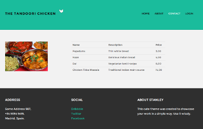

# Restaurant

Hello. This is an example app using the following techniques:

* Node.js
* Express.js
* MongoDB
* Angular.js
* For authentication, it uses [Passport-Local-Mongoose](https://github.com/saintedlama/passport-local-mongoose)
* For testing, it uses [Mocha](http://mochajs.org/), [Chai](http://chaijs.com/) and [SuperAgent](https://github.com/visionmedia/superagent)
* For environment variables it uses [dotenv-node](https://www.npmjs.com/package/dotenv-node)
* In Angular, the [ui router](https://github.com/angular-ui/ui-router) is used over ng-route.
* The wonderful template is the free bootstrap theme from [Stanley](http://www.blacktie.co/demo/stanley/).




## Run it

Prequisites are Node.js and MongoDb. It works on OSX, Linux (Ubuntu 14.04 and up and Fedora 21). Not sure about Windows.


Clone it
```
git clone https://github.com/jacqinthebox/Restaurant.git
```

CD into the folder.
```
cd Restaurant
```

Issue an

```
npm install
```

and

```
bower install
```

Start the app with:

```
NODE_ENV=example node server.js
```

Note that you can log on with:
```
username: admin@example.com
password: admin
```

May you have suggestions for improvement, they are very welcome! Please visit us at [The ButtonFactory](http://www.thebuttonfactory.nl/).

